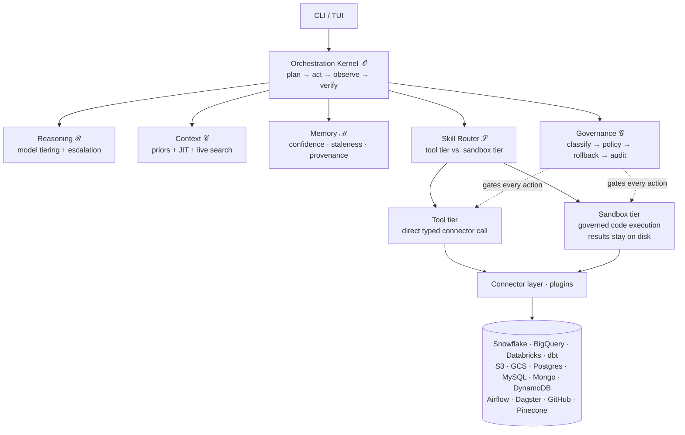

<div align="center">

# dacli

**An autonomous, reliability-first data-engineering agent for your terminal.**

*Talk to your data stack in plain language — dacli plans, runs SQL, moves files, builds pipelines,
orchestrates jobs, and draws diagrams across 14 platforms, with governance and verification on every action.*

[](https://github.com/mouadja02/dacli/actions/workflows/ci.yml)
[](https://www.python.org/)
[](#testing)
[](docs/EVALUATION.md)
[](docs/ARCHITECTURE.md)

[Quick start](#quick-start) · [Architecture](docs/ARCHITECTURE.md) · [Connectors](docs/CONNECTORS.md) · [Governance](docs/GOVERNANCE.md) · [Evaluation](docs/EVALUATION.md)

</div>

---

## Table of contents

- [Why dacli](#why-dacli)
- [Highlights](#highlights)
- [How it works](#how-it-works)
- [Supported platforms](#supported-platforms)
- [Installation](#installation)
- [Configuration](#configuration)
- [Quick start](#quick-start)
- [Command reference](#command-reference)
- [Reliability: the environment is the oracle](#reliability-the-environment-is-the-oracle)
- [Project layout](#project-layout)
- [Extending dacli](#extending-dacli)
- [Testing](#testing)
- [Documentation](#documentation)
- [Status](#status)
- [Contributing](#contributing)
- [License](#license)

---

## Why dacli

Most "AI for data" tools are a chat window that gives *advice*. dacli is an **agent that operates your stack**:
it reasons over a real, connected toolset — warehouses, lakes, operational databases, transformation,
orchestration, and diagramming — and carries tasks through to a verified result.

The hard problem with autonomous data agents is not capability, it is **reliability**. A 95%-reliable
`DROP`-guard is a catastrophe waiting for its 1-in-20. dacli is built on a simple thesis, drawn from
*["From Model Scaling to System Scaling"](https://arxiv.org/abs/2605.26112)*:

> **Agent reliability is a property of the *system around the model*, not the model.**
> Stale memory, diluted context, unchecked tool output, and missing governance are *system failures* that
> survive every model upgrade.

So dacli is engineered as a **six-component harness** (ℛ Reasoning · ℳ Memory · 𝒞 Context · 𝒮 Skills ·
𝒪 Orchestration · 𝒢 Governance), and its signature idea is **"the environment is the oracle"** — verification
and rollback are anchored to native platform features (transactions, Time Travel/`UNDROP`, `EXPLAIN`/`dry_run`,
zero-copy clones, `dbt test`, row counts) rather than to the model's own say-so.

> Built **from scratch** — no agent frameworks (no LangChain/LangGraph) and **no MCP**. Tools are plain
> Python/CLI the agent composes as code, which keeps context lean and execution auditable.

---

## Highlights

| | |
|---|---|
| 🧠 **Conversational data ops** | Describe the goal; dacli plans a DAG, routes each step, acts, observes, and verifies — iterating until the outcome is provably correct. |
| 🔌 **14 platform connectors** | Each platform is a self-describing plugin discovered from a `manifest.yaml`. Adding one is "drop in a folder", never "edit the agent". |
| 🛡️ **Governance on every action** | A blast-radius classifier tiers each action `safe → write → risky → irreversible`, then a policy engine gates it: auto, verify, confirm, or dry-run + verified-rollback + approval. |
| ✅ **Verified, not just fluent** | Every operation declares **environment-anchored post-conditions**; a result is "done" only when the platform confirms it (row counts, `bq show`, statement state, `dbt` artifacts). |
| 🧪 **Code-execution sandbox** | Complex/multi-step/cross-platform jobs run as governed code; large results stay **on disk**, out of the model's context. |
| 📒 **Trustworthy memory** | Typed facts with confidence, recency, and provenance; retrieval penalizes staleness; trust is a **runtime decision** — re-verified against the live system before acting. |
| 🧭 **Multi-agent orchestration** | A lead fans breadth-first work out to isolated-context sub-agents with contradiction detection and de-duplication. |
| 📊 **pass^k reliability eval** | An offline golden suite measures consistency across *repeated* rollouts (not single-shot luck), with regression detection and a reliability dashboard. |
| 🔍 **Fully auditable** | Append-only ledgers record every classification, policy decision, rollback plan, approval, and post-condition verdict — `dacli audit` reconstructs *why* the agent acted. |
| 🤖 **Multi-provider LLM** | OpenAI, Anthropic, or OpenRouter (Google Gemini planned), with cheap/strong **model tiering** and confidence-aware escalation. |

---

## How it works



Every state-changing action flows through one governed dispatch path — so the tool tier *and* the
code-execution sandbox are governed and verified identically. See [docs/ARCHITECTURE.md](docs/ARCHITECTURE.md)
for the full design.

---

## Supported platforms

dacli ships **14 platform connectors** plus a diagram-as-code skill. Each connector declares its operations,
risk tiers, environment-anchored post-conditions, and a native rollback primitive (the "Definition of Done",
enforced in CI — see [docs/CONNECTORS.md](docs/CONNECTORS.md)).

| Category | Connector | Highlights | Native rollback primitive |
|---|---|---|---|
| **Warehouses** | ❄️ Snowflake | SQL, context introspection, catalog | Time Travel / `UNDROP`, zero-copy clone |
| | 🔷 BigQuery | SQL, `dry_run` cost preview, `bq show` oracle | table snapshot / time travel |
| | 🧱 Databricks | SQL warehouse, statement-state oracle | Delta time travel / shallow clone |
| **Transformation** | 🔧 dbt | `run`/`build`/`test`, manifest lineage | git-versioned transform + target snapshot |
| **Object storage** | 🪣 Amazon S3 | list/read/put/delete, head-object oracle | versioned copy-aside |
| | ☁️ Google Cloud Storage | list/read/put/delete, `ls` oracle | object versioning |
| **Operational DBs** | 🐘 PostgreSQL | SQL via `psql`, transactional DDL | transaction / `pg_dump` |
| | 🐬 MySQL | SQL via `mysql` | transaction / `mysqldump` |
| | 🍃 MongoDB | queries via `mongosh`, schema inference | `mongodump` copy-aside |
| | ⚡ DynamoDB | item/table ops via `aws dynamodb` | point-in-time recovery |
| **Orchestration** | 🌬️ Airflow | trigger/monitor DAGs (REST API) | unpause / gated (no native undo) |
| | 🧩 Dagster | launch/monitor runs (GraphQL) | gated (terminate run) |
| **DevOps / docs** | 🐙 GitHub | repo files, Actions workflows, logs | revert commit / restore blob by SHA |
| | 📚 Pinecone | semantic search over your knowledge base | n/a (read-mostly) |
| **Diagramming** | 🎨 Mermaid *(skill)* | diagram-as-code from the live catalog | n/a |

CLI-first connectors (BigQuery, Databricks, dbt, S3, GCS, Postgres, MySQL, MongoDB, DynamoDB) shell out to
the platform's **first-class CLI** rather than bundling SDKs — install the CLIs you actually use.

---

## Installation

**Requirements:** Python **3.10+** (CI runs 3.10–3.12).

```bash
git clone https://github.com/mouadja02/dacli.git
cd dacli

python -m venv .venv
# Windows
.venv\Scripts\activate
# macOS / Linux
source .venv/bin/activate

pip install -r requirements.txt
pip install -e .            # editable: puts the `dacli` command on your PATH AND runs your working tree
```

> Use the **editable** install (`-e`). A plain `pip install .` copies the
> sources into `site-packages`, so the `dacli` command then runs that frozen
> copy and silently diverges from your working tree as you edit.

For CLI-first connectors, install the relevant platform CLIs and authenticate them as you normally would:

| Connector | CLI to install |
|---|---|
| BigQuery / GCS | Google Cloud SDK (`bq`, `gcloud`) |
| Databricks | Databricks CLI (`databricks`) |
| S3 / DynamoDB | AWS CLI (`aws`) |
| dbt | `dbt-core` + the relevant adapter (e.g. `dbt-snowflake`) |
| Postgres / MySQL / Mongo | `psql` / `mysql` / `mongosh` |

---

## Configuration

dacli reads a `config.yaml` and substitutes secrets from environment variables (`${VAR}` placeholders),
which you supply via a `.env` file. Credentials never live in the config file.

```bash
cp config_template.yaml config.yaml     # set provider/model + account identifiers
cp .env.example .env                     # fill in your secrets
```

```dotenv
# .env
LLM_API_KEY=...
GITHUB_TOKEN=...
SNOWFLAKE_PASSWORD=...
PINECONE_API_KEY=...
OPENAI_API_KEY=...        # used for Pinecone embeddings
```

> `config.yaml`, `.env`, and the wizard-generated `config/connectors.yaml` are git-ignored.
> Full reference: **[docs/CONFIGURATION.md](docs/CONFIGURATION.md)**.

> **State durability & sessions.** Session state, encrypted secrets, memory, and
> usage live under `.dacli/` and are written **atomically** (temp file → `fsync`
> → `os.replace`), so a crash or `Ctrl-C` mid-write can never truncate or wipe a
> state file — a reader always sees the complete old or new file. There is **no
> cross-process lock**, so run **one dacli session per project directory at a
> time**; two sessions sharing the same `.dacli/` can overwrite each other's
> last-write-wins state.

---

## Quick start

```bash
dacli                 # first run launches the setup wizard, then drops into chat
dacli setup           # (re)configure which connectors/operations are enabled
dacli validate        # live-test every enabled connector's credentials
dacli eval --quick    # run the offline reliability suite (pass^k) against simulated platforms

# …or without installing the command:
python run.py
```

On first run the **setup wizard** asks which connectors to enable and validates each with a live health check.
Then just describe what you want:

> *"Stand up a Bronze→Silver pipeline for the CRM source in Snowflake, then run the dbt models and confirm
> every test passes."*

dacli decomposes the goal into an inspectable plan, asks for approval where the blast radius warrants it,
executes step by step, and verifies each step against the platform before moving on.

---

## Command reference

### CLI subcommands

| Command | Description |
|---|---|
| `dacli` · `dacli chat` | Start the interactive chat (default). |
| `dacli setup [--profile <name>]` | Connector setup wizard. Profiles: `full`, `none`, `<connector>_only`. |
| `dacli validate` | Live-test every enabled connector's credentials. |
| `dacli eval [--quick] [--regression] [--calibrate] [--json]` | Run the pass^k reliability suite + dashboard. |
| `dacli audit [--session <id>] [--full]` | Reconstruct governance decisions ("why did it act?"). |
| `dacli context [--task <t>] [--explain]` | Inspect the assembled context (sources, tokens, budget). |
| `dacli sessions` · `dacli load <id>` | List / resume previous sessions. |
| `dacli init` | Write a fresh default `config.yaml`. |
| `dacli prompt` | View the active system prompt. |
| `dacli --version` | Show the version. |

### In-chat slash commands

`/help` · `/status` · `/usage` · `/context` · `/audit` · `/tools` · `/setup` · `/history` · `/sessions` ·
`/load <id>` · `/export` · `/config` · `/theme <name>` · `/prompt` · `/init` · `/clear` · `/reset` · `/exit`

---

## Reliability: the environment is the oracle

dacli refuses to ask the model *"did that work?"* — it asks the platform. This shows up everywhere:

- **Pre-conditions** — `EXPLAIN`, BigQuery `dry_run`, `dbt compile` validate before anything runs.
- **Post-conditions** — a `CREATE` is confirmed by `bq show`; a put is confirmed by `head-object`; a `dbt run`
  is confirmed by `run_results.json`. Fluent success is never accepted as proof.
- **Rollback** — irreversible actions are **blocked unless a native undo path is *verified to exist***
  (versioning enabled, retention window open, snapshot taken) — not merely assumed.
- **pass^k** — reliability is measured as success across *k repeated* rollouts, not a single lucky run.
  The destructive-action gate is held to the highest bar.

```text
$ dacli eval --quick
Reliability dashboard — suite: sim
----------------------------------------------------------------------------------------------
connector          tasks  pass@1  pass^k   succ    esc   corr    gov  unguard     tok       ms
----------------------------------------------------------------------------------------------
bigquery               3    1.00    1.00   1.00   0.00   0.00   0.00        0       0      0.1
s3                     3    1.00    1.00   1.00   0.00   0.00   0.00        0       0      0.1
spine                  5    1.00    1.00   1.00   0.00   0.20   0.20        0       0      1.0
...
OVERALL               26    1.00    1.00   1.00   0.00   0.04   0.04        0       0     29.1
----------------------------------------------------------------------------------------------
✓ zero unguarded destructive executions.
```

Details: **[docs/GOVERNANCE.md](docs/GOVERNANCE.md)** and **[docs/EVALUATION.md](docs/EVALUATION.md)**.

---

## Project layout

```text
dacli/
├── scripts/cli.py        # CLI entry point (the `dacli` command)
├── core/                 # 𝒪 orchestration: kernel, planner (DAG), plan-act-observe-verify loop,
│                         #   blackboard, sub-agents, memory facade, pricing/usage, store
├── reasoning/            # ℛ multi-provider LLM client + cheap/strong model router
├── context/              # 𝒞 context constructor: assembler, budget, compaction, disclosure, spill
├── memory/               # ℳ trust-aware store, retrieval (staleness), catalog cache, episodic/procedural
├── connectors/           # 𝒮 microkernel plugin layer
│   ├── base.py           #   Connector ABC · OperationSpec · ToolResult · Risk
│   ├── registry.py       #   manifest discovery + tool definitions + resolver
│   ├── dispatcher.py     #   one governed dispatch path (verify + audit)
│   ├── dod.py            #   Definition-of-Done gate (CI-enforced)
│   └── <platform>/       #   connector.py + manifest.yaml + SKILL.md (×14)
├── governance/           # 𝒢 classifier, policy engine, permissions, rollback, shadow, audit ledger
├── sandbox/              # governed code-execution runtime (results stay on disk)
├── skills/               # contracted skills (e.g. diagram_mermaid) with mandatory post-conditions
├── eval/                 # pass^k harness, simulated platforms, golden suites, regression, dashboard
├── prompts/              # system message + guidelines + loaders
├── config/               # typed pydantic settings + env-var substitution
└── tui/                  # themed terminal UI
```

---

## Extending dacli

Adding a platform never touches `core/`, `reasoning/`, or `governance/`. Drop a folder:

```text
connectors/myplatform/
├── connector.py     # subclass Connector: operations(), invoke(), health() (+ verify_rollback for irreversible ops)
├── manifest.yaml    # id, class, required_config, default_scope, golden_task
└── SKILL.md         # progressive-disclosure doc
```

A connector only ships when it passes the **Definition of Done** (enforced by CI): operations with JSON
schemas, ≥1 **environment-anchored** post-condition per mutating op, a registered rollback strategy,
an introspection op, a least-privilege scope, and a verifiable golden task. Full guide:
**[docs/CONNECTORS.md](docs/CONNECTORS.md)**.

---

## Testing

```bash
# Full suite (200 tests)
python -m unittest discover -s tests -p "test_*.py"

# Connector Definition-of-Done gate (governance debt guard)
python -m unittest tests.test_connector_dod

# Offline reliability suite (pass^k) against simulated platforms
python -m dacli.eval --quick
```

CI runs the DoD gate, the full suite (Python 3.10–3.12), and the pass^k sim suite on every pull request.

---

## Documentation

| Doc | What's inside |
|---|---|
| [docs/ARCHITECTURE.md](docs/ARCHITECTURE.md) | The six-component harness, the microkernel, and the two execution tiers. |
| [docs/CONNECTORS.md](docs/CONNECTORS.md) | The connector catalog, the Definition of Done, and how to add a platform. |
| [docs/GOVERNANCE.md](docs/GOVERNANCE.md) | Blast-radius tiers, policy, rollback, the audit ledger, permissions, and the sandbox. |
| [docs/EVALUATION.md](docs/EVALUATION.md) | pass^k, golden suites, regression detection, the dashboard, and self-improvement. |
| [docs/CONFIGURATION.md](docs/CONFIGURATION.md) | The full `config.yaml` reference, env vars, and connector enablement. |
| [CONTRIBUTING.md](CONTRIBUTING.md) | Development setup, the DoD checklist, and contribution workflow. |

---

## Status

dacli is actively developed, with all six harness components implemented and exercised by the test suite:

| Capability area | Component | Status |
|---|---|---|
| Microkernel + connector plugin registry | 𝒮 | ✅ |
| Trust-aware memory (confidence · staleness · provenance) + catalog cache | ℳ | ✅ |
| Context constructor (budget · provenance · compaction · progressive disclosure) | 𝒞 | ✅ |
| Skill routing with mandatory environment-anchored post-conditions | 𝒮 | ✅ |
| Tiered governance + code-execution sandbox | 𝒢 | ✅ |
| Plan-act-observe-verify orchestration + multi-agent | 𝒪 / ℛ | ✅ |
| 14 platform connectors | 𝒮 / 𝒢 | ✅ |
| pass^k evaluation, regression detection & gated self-improvement | all | ✅ |

---

## Contributing

Contributions are welcome — see **[CONTRIBUTING.md](CONTRIBUTING.md)**. The one rule that is non-negotiable:
**scale skills and governance together.** Every new capability ships with its post-conditions, rollback
strategy, permission scope, and golden task, or it does not ship — and CI enforces it.

---

## License

This project was created by **Mouad Jaouhari**. If a `LICENSE` file is not yet present in the repository,
please contact the author before reuse or redistribution.

---

<div align="center">
<sub>Grounded in the six-component harness framework — <a href="https://arxiv.org/abs/2605.26112">arXiv:2605.26112</a>.
Built from scratch: no agent frameworks, no MCP, reliability first.</sub>
</div>
