<div align="center">



**dacli is a data-engineering agent for the terminal.**

*It plans work, runs governed tool calls, and verifies results against the data systems it touches.*

[](https://github.com/mouadja02/dacli/actions/workflows/ci.yml)
[](https://www.python.org/)
[](#testing)
[](docs/EVALUATION.md)
[](docs/ARCHITECTURE.md)

[Quick start](#quick-start) · [Architecture](docs/ARCHITECTURE.md) · [Connectors](docs/CONNECTORS.md) · [Governance](docs/GOVERNANCE.md) · [Evaluation](docs/EVALUATION.md)

<br>


<sub>And the real terminal, offline — no API key, no network. Crisp vector version: <a href="assets/demo.svg"><code>assets/demo.svg</code></a>.</sub>

</div>

---

## Table of contents

- [Design](#design)
- [Highlights](#highlights)
- [How it works](#how-it-works)
- [Supported platforms](#supported-platforms)
- [Installation](#installation)
- [Configuration](#configuration)
- [Quick start](#quick-start)
- [Command reference](#command-reference)
- [Reliability: the environment is the oracle](#reliability-the-environment-is-the-oracle)
- [Project layout](#project-layout)
- [Extending dacli](#extending-dacli)
- [Testing](#testing)
- [Documentation](#documentation)
- [Status](#status)
- [Contributing](#contributing)
- [License](#license)

---

<br>

<div align="center">

[](assets/dacli-promo.mp4)

<sub>The full 35-second tour — thesis, governed tier ramp, pass^k, connectors. With sound: <a href="assets/dacli-promo.mp4"><code>assets/dacli-promo.mp4</code></a> (click to play).</sub>

</div>

## Design

dacli is not a SQL chatbot. It turns a plain-language data task into a governed plan, runs connector
operations or sandboxed code, and accepts a result only after the target system confirms it.

The hard problem with autonomous data agents is not capability, it is reliability. A 95%-reliable
`DROP` guard is a catastrophe waiting for its 1-in-20. dacli is built on a simple thesis, drawn from
*["From Model Scaling to System Scaling"](https://arxiv.org/abs/2605.26112)*:

> **Agent reliability is a property of the *system around the model*, not the model.**
> Stale memory, diluted context, unchecked tool output, and missing governance are *system failures* that
> survive every model upgrade.

That thesis shows up as a six-component harness (ℛ Reasoning · ℳ Memory · 𝒞 Context · 𝒮 Skills ·
𝒪 Orchestration · 𝒢 Governance). "The environment is the oracle" means verification and rollback are
anchored to native platform features (transactions, Time Travel/`UNDROP`, `EXPLAIN`/`dry_run`,
zero-copy clones, `dbt test`, row counts), not the model's own say-so.

> dacli does not depend on LangChain or LangGraph. The core is MCP-free: tools are plain Python/CLI calls
> composed by the agent, with the same governed dispatch path for direct tools and sandboxed code. An opt-in
> MCP client bridge can proxy one external MCP server through that path; the core itself never speaks MCP.

---

## Highlights

| | |
|---|---|
| 🧠 **Data ops from chat** | Describe the goal; dacli acts through governed tools, observes the result, and verifies it against the platform before treating it as done. |
| 🔌 **14 platform connectors** | Each platform is a self-describing plugin discovered from a `manifest.yaml`. Adding one means adding a connector folder, not editing the agent. |
| 🛡️ **Governance on every action** | A blast-radius classifier tiers each action `safe → write → risky → irreversible`, then a policy engine gates it: auto, verify, confirm, or dry-run + verified-rollback + approval. |
| ✅ **Verified results** | Every operation declares **environment-anchored post-conditions**; a result is "done" only when the platform confirms it (row counts, `bq show`, statement state, `dbt` artifacts). |
| 🧪 **Code-execution sandbox** | Complex/multi-step/cross-platform jobs run as governed code; large results stay **on disk**, out of the model's context. |
| 📒 **Trust-aware memory** | Typed facts with confidence, recency, and provenance; retrieval penalizes staleness; trust is a runtime decision, re-verified against the live system before acting. |
| 🧭 **Multi-agent orchestration** | A lead fans breadth-first work out to isolated-context sub-agents with contradiction detection and de-duplication. |
| 📊 **pass^k reliability eval** | An offline golden suite measures consistency across *repeated* rollouts (not single-shot luck), with regression detection and a reliability dashboard. |
| 🔍 **Audit trail** | Append-only ledgers record every classification, policy decision, rollback plan, approval, and post-condition verdict; `dacli audit` reconstructs *why* the agent acted. |
| 🤖 **Multi-provider LLM** | OpenAI, Anthropic, or OpenRouter (Google Gemini planned), with cheap/strong **model tiering** and confidence-aware escalation. |
| 🎨 **Terminal UI** | Pure Rich + prompt-toolkit: live formatted Markdown streaming, tier-colored tool cards, a context gauge, an approval panel, and seven themes, with `NO_COLOR`, ASCII glyphs, reduced motion, high contrast, and native scrollback. |

---

## How it works

<div align="center">

</div>

Every state-changing action flows through one governed dispatch path — so the tool tier *and* the
code-execution sandbox are governed and verified identically. The diagram is rendered from
[`assets/architecture.mmd`](assets/architecture.mmd); see [docs/ARCHITECTURE.md](docs/ARCHITECTURE.md)
for the full design.

---

## Supported platforms

dacli ships **14 platform connectors** plus a diagram-as-code skill. Each connector declares its operations,
risk tiers, environment-anchored post-conditions, and a native rollback primitive (the "Definition of Done",
enforced in CI — see [docs/CONNECTORS.md](docs/CONNECTORS.md)).

| Category | Connector | Highlights | Native rollback primitive |
|---|---|---|---|
| **Warehouses** | ❄️ Snowflake | SQL, context introspection, catalog | Time Travel / `UNDROP`, zero-copy clone |
| | 🔷 BigQuery | SQL, `dry_run` cost preview, `bq show` oracle | table snapshot / time travel |
| | 🧱 Databricks | SQL warehouse, statement-state oracle | Delta time travel / shallow clone |
| **Transformation** | 🔧 dbt | `run`/`build`/`test`, manifest lineage | git-versioned transform + target snapshot |
| **Object storage** | 🪣 Amazon S3 | list/read/put/delete, head-object oracle | versioned copy-aside |
| | ☁️ Google Cloud Storage | list/read/put/delete, `ls` oracle | object versioning |
| **Operational DBs** | 🐘 PostgreSQL | SQL via `psql`, transactional DDL | transaction / `pg_dump` |
| | 🐬 MySQL | SQL via `mysql` | transaction / `mysqldump` |
| | 🍃 MongoDB | queries via `mongosh`, schema inference | `mongodump` copy-aside |
| | ⚡ DynamoDB | item/table ops via `aws dynamodb` | point-in-time recovery |
| **Orchestration** | 🌬️ Airflow | trigger/monitor DAGs (REST API) | unpause / gated (no native undo) |
| | 🧩 Dagster | launch/monitor runs (GraphQL) | gated (terminate run) |
| **DevOps / docs** | 🐙 GitHub | repo files, Actions workflows, logs | revert commit / restore blob by SHA |
| | 📚 Pinecone | semantic search over your knowledge base | n/a (read-mostly) |
| **Diagramming** | 🎨 Mermaid *(skill)* | diagram-as-code from the live catalog | n/a |

CLI-first connectors (BigQuery, Databricks, dbt, S3, GCS, Postgres, MySQL, MongoDB, DynamoDB) shell out to
the platform's **first-class CLI** rather than bundling SDKs — install the CLIs you actually use.

---

## Installation

**Requirements:** Python **3.10+** (CI runs 3.10–3.12).

End users — an isolated, on-PATH install:

```bash
pipx install dacli          # or: uv tool install dacli
```

Embedding dacli as a library:

```bash
pip install dacli
```

> On PyPI as of v0.3.0 — `pipx`/`uv`/`pip` is the one-line path. To hack on it,
> install [from source](#from-source) instead.

### First 2 minutes

```bash
pipx install dacli
dacli                                  # bootstraps your LLM key (encrypted, no .env needed)
> ask it something about your data
dacli diff bigquery ds.a ds.b          # read-only data diff — zero risk, no creds
```

`eval` and `diff` run fully offline: no API key, no network, no credentials. They're the
zero-risk way to see what dacli does before you wire up a single connector.

### From source

```bash
git clone https://github.com/mouadja02/dacli.git
cd dacli

python -m venv .venv
# Windows
.venv\Scripts\activate
# macOS / Linux
source .venv/bin/activate

# dacli is four wheels (M13); install all four editable to run the working tree.
pip install -e packages/dacli-ai -e packages/dacli-core \
            -e packages/dacli-tui -e packages/dacli
```

Optional extras:

```bash
pip install -e "packages/dacli[all]"   # + every Python-SDK seed (snowflake)
pip install -e "packages/dacli[dev]"   # contributors: pytest, ruff, vulture
pip install -e "packages/dacli[pty]"   # faithful TTY for the governed terminal
```

> Use the **editable** install (`-e`). A plain `pip install .` copies the
> sources into `site-packages`, so the `dacli` command then runs that frozen
> copy and silently diverges from your working tree as you edit.

> A headless embedder needs only the lower two wheels: `pip install dacli-core`
> (it pulls `dacli-ai`) runs a turn with no TUI installed.

> For a byte-for-byte reproducible environment (what CI uses), install the pinned
> closure first: `pip install -r requirements.lock`, then the four wheels
> `--no-deps`.

For CLI-first connectors, install the relevant platform CLIs and authenticate them as you normally would:

| Connector | CLI to install |
|---|---|
| BigQuery / GCS | Google Cloud SDK (`bq`, `gcloud`) |
| Databricks | Databricks CLI (`databricks`) |
| S3 / DynamoDB | AWS CLI (`aws`) |
| dbt | `dbt-core` + the relevant adapter (e.g. `dbt-snowflake`) |
| Postgres / MySQL / Mongo | `psql` / `mysql` / `mongosh` |

Something off? run `dacli doctor` — it reports where config, state, and logs resolve, your LLM key's
source (never the value), governance/sandbox posture, and per-connector health.

---

## Configuration

**There is nothing to configure by hand.** The first `dacli` run launches the setup wizard: pick a
provider and model, paste an API key, choose connectors — secrets are encrypted at rest into
`.dacli/dacli.json` (see the [security model](#security-model)). No `config.yaml`, no `.env` needed.

```bash
dacli        # first run → wizard → chatting
```

### Advanced: file-based configuration (power users & CI)

dacli also reads a `config.yaml` (searched at the project root, then the per-user config dir) and
substitutes secrets from environment variables (`${VAR}` placeholders), which you can supply via a
`.env` file. Credentials never live in the config file.

```bash
dacli init                               # write a commented config.yaml to start from
cp .env.example .env                     # fill in your secrets
```

```dotenv
# .env
LLM_API_KEY=...
GITHUB_TOKEN=...
SNOWFLAKE_PASSWORD=...
PINECONE_API_KEY=...
OPENAI_API_KEY=...        # used for Pinecone embeddings
```

> `config.yaml`, `.env`, and the wizard-generated `config/connectors.yaml` are git-ignored.
> Full reference: **[docs/CONFIGURATION.md](docs/CONFIGURATION.md)**.

> **State durability & sessions.** Session state, encrypted secrets, memory, and
> usage live under `.dacli/` and are written **atomically** (temp file → `fsync`
> → `os.replace`), so a crash or `Ctrl-C` mid-write can never truncate or wipe a
> state file — a reader always sees the complete old or new file. There is **no
> cross-process lock**, so run **one dacli session per project directory at a
> time**; two sessions sharing the same `.dacli/` can overwrite each other's
> last-write-wins state.

### Security model

Secrets entered through the wizard or `/connect` are encrypted at rest with **Fernet**; the encryption key
lives in `.dacli/.key` (git-ignored), next to the ciphertext in `.dacli/dacli.json`. Be clear about what
that buys you:

- **Protects against:** accidentally committing secrets to git, and casual inspection (screen-shares,
  shoulder-surfing, grepping a backup of the repo).
- **Does not protect against:** a local attacker with filesystem access — the key and the ciphertext are
  co-located, so anyone who can read one can read both. The `chmod 600` on the key file is best-effort and
  a no-op on Windows.

If you want the key off-disk, set the `DACLI_ENCRYPTION_KEY` environment variable (e.g. from a secret
manager); it takes priority over `.dacli/.key` and accepts either a raw Fernet key or a password (derived
into one via PBKDF2). This is appropriate for a local single-user tool; it is not a substitute for an
OS keychain or a vault.

---

## Quick start

```bash
dacli                 # first run launches the setup wizard, then drops into chat
dacli setup           # (re)configure which connectors/operations are enabled
dacli validate        # live-test every enabled connector's credentials
dacli eval --quick    # run the offline reliability suite (pass^k) against simulated platforms

# …or without installing the command:
python run.py
```

On first run the **setup wizard** walks you through provider, model, and API key, then asks which
connectors to enable — validating each with a live health check. Then just describe what you want:

> *"Stand up a Bronze→Silver pipeline for the CRM source in Snowflake, then run the dbt models and confirm
> every test passes."*

dacli decomposes the goal into an inspectable plan, asks for approval where the blast radius warrants it,
executes step by step, and verifies each step against the platform before moving on.

**Worked example.** [`examples/warehouse-snowflake/`](examples/warehouse-snowflake/) builds a
Bronze → Silver → Gold warehouse in Snowflake from two dirty CSVs — raw load, dedup/conform, analytics
marts, a data-quality gate, and a Time Travel rollback. No Snowflake account? The same folder replays the
governed plan offline (`dacli replay examples/warehouse-snowflake/scenario.json`).

---

## Command reference

### CLI subcommands

| Command | Description |
|---|---|
| `dacli` · `dacli chat` | Start the interactive chat (default). |
| `dacli diff <connector> <a> <b> [--sample N]` | Read-only data diff: row-count delta, per-column null rates over a bounded sample, sampled value comparison. The agent-side `data_diff` skill adds an approval-gated `mode=promote`. |
| `dacli setup [--profile <name>]` | Connector setup wizard. Profiles: `full`, `none`, `<connector>_only`. |
| `dacli validate` | Live-test every enabled connector's credentials. |
| `dacli doctor [--ping] [--json]` | Diagnose where config/state/log resolve, the LLM key + its source (never the value), governance/sandbox/terminal posture and connector status. Offline by default (`--ping` adds a bounded models/list probe); exits non-zero on a hard problem. |
| `dacli eval [--quick] [--regression] [--calibrate] [--json] [--report <path>.md\|.html]` | Run the pass^k reliability suite + dashboard; `--report` writes a shareable Markdown/HTML scorecard. |
| `dacli audit [--session <id>] [--full]` | Reconstruct governance decisions ("why did it act?"). |
| `dacli context [--task <t>] [--explain]` | Inspect the assembled context (sources, tokens, budget). |
| `dacli catalog [--connector <id>]` | List known data objects from the catalog cache. |
| `dacli schema <object>` | Show cached columns / row count for one object. |
| `dacli lineage <object> [--json]` | Show known upstream producers / downstream consumers (dbt manifest, view deps, orchestrator DAGs). Best-effort; feeds blast-radius governance. |
| `dacli why-failed [--source dbt\|airflow] [--dag <id>] [--run <id>] [--apply] [--json]` | Explain the most recent pipeline failure: locate the failed node (dbt run-results / orchestrator), read its logs read-only, correlate via lineage, and propose a governed fix. `--apply` routes the fix through classify → approve → verify → rollback; nothing is applied otherwise. |
| `dacli assert define\|list\|run\|delete` | Author and run connector-agnostic data-quality assertions (null-rate / row-count). `run` measures the metric through the governed query op; a breach proposes a remediation, and `--apply` routes it through the governance gate. Exits non-zero on a breach so CI can gate. |
| `dacli runbook save\|list\|show\|run` | Save and run a parameterized headless task with a **policy envelope** — approvals pre-granted only within a tool set and tier ceiling; anything outside still blocks. Drives the headless path for cron/CI; the envelope and every decision land in the audit ledger. |
| `dacli cost <connector> [--estimate "<sql>"] [--session] [--json]` | Warehouse cost advisor: pre-run estimate (reusing the connector's native estimator) and post-hoc session spend from the platform history view, read-only through the governed dispatcher. Supports snowflake, bigquery, databricks. |
| `dacli run "<message>" [--json] [--approve approve\|deny] [--llm-script <file>]` | One headless agent turn with a machine-readable JSON result and a stable exit-code contract. |
| `dacli replay <scenario.json> [--json]` | Replay a scenario file (ordered user turns + optional scripted LLM) headlessly — what the [CI gate](#extending-dacli) runs. |
| `dacli connector install <name> --index <path\|url> [--force]` | Fetch a shared connector from an index, validate it in a sandboxed subprocess, register it **disabled**. |
| `dacli export-run [--session <id>] [--out <zip>]` | Export a session as a compliance bundle: transcript + audit slice + usage, secrets redacted. |
| `dacli sessions` · `dacli load <id>` | List / resume previous sessions. |
| `dacli init` | Write a fresh default `config.yaml`. |
| `dacli prompt` | View the active system prompt. |
| `dacli chat` | Start the interactive chat explicitly (same as bare `dacli`). |
| `dacli --version` | Show the version. |

### In-chat slash commands

`/help` · `/keys` · `/init` · `/status` · `/doctor` · `/usage` · `/context` · `/audit` · `/why-failed [dag]` · `/tools` · `/connect [ext]` ·
`/new-extension` · `/reload` · `/testmode [tool]` ·
`/setup` · `/history` · `/find <text>` · `/last-error` · `/expand <id>` · `/transcript` · `/sessions` ·
`/catalog [connector]` · `/schema <object>` · `/load <id>` · `/export` ·
`/config` · `/theme <name>` · `/prompt` · `/clear` · `/cls` · `/reset` · `/exit`

---

## Reliability: the environment is the oracle

dacli refuses to ask the model *"did that work?"* — it asks the platform. This shows up everywhere:

- **Pre-conditions** — `EXPLAIN`, BigQuery `dry_run`, `dbt compile` validate before anything runs.
- **Post-conditions** — a `CREATE` is confirmed by `bq show`; a put is confirmed by `head-object`; a `dbt run`
  is confirmed by `run_results.json`. Fluent success is never accepted as proof.
- **Rollback** — irreversible actions are **blocked unless a native undo path is *verified to exist***
  (versioning enabled, retention window open, snapshot taken) — not merely assumed.
- **Cost as blast radius** — set `governance.cost_confirm_usd` and any action whose connector-estimated
  cost (e.g. BigQuery `dry_run` bytes) exceeds it requires a human confirm, with the estimate shown in
  the approval panel.
- **pass^k** — reliability is measured as success across *k repeated* rollouts, not a single lucky run.
  The destructive-action gate is held to the highest bar.

```text
$ dacli eval --quick
Reliability dashboard — suite: sim
----------------------------------------------------------------------------------------------
connector          tasks  pass@1  pass^k   succ    esc   corr    gov  unguard     tok       ms
----------------------------------------------------------------------------------------------
github                 1    1.00    1.00   1.00   0.00   0.00   0.00        0       0      0.1
snowflake              1    1.00    1.00   1.00   0.00   0.00   0.00        0       0      0.1
shell                  7    1.00    1.00   1.00   0.00   0.00   0.29        0       0     19.5
spine                  3    1.00    1.00   1.00   0.00   0.20   0.20        0       0      1.0
OVERALL               12    1.00    1.00   1.00   0.00   0.03   0.09        0       0     11.0
----------------------------------------------------------------------------------------------
✓ zero unguarded destructive executions.
```

Details: **[docs/GOVERNANCE.md](docs/GOVERNANCE.md)** and **[docs/EVALUATION.md](docs/EVALUATION.md)**.

---

## Project layout

```text
dacli/
├── scripts/cli.py        # CLI entry point (the `dacli` command)
├── core/                 # 𝒪 orchestration: kernel, planner (DAG), plan-act-observe-verify loop,
│                         #   blackboard, sub-agents, memory facade, pricing/usage, store
├── reasoning/            # ℛ multi-provider LLM client + cheap/strong model router
├── context/              # 𝒞 context constructor: assembler, budget, compaction, disclosure, spill
├── memory/               # ℳ trust-aware store, retrieval (staleness), catalog cache, episodic/procedural
├── connectors/           # 𝒮 microkernel plugin layer
│   ├── base.py           #   Connector ABC · OperationSpec · ToolResult · Risk
│   ├── registry.py       #   manifest discovery + tool definitions + resolver
│   ├── dispatcher.py     #   one governed dispatch path (verify + audit)
│   ├── dod.py            #   Definition-of-Done gate (CI-enforced)
│   └── <platform>/       #   connector.py + manifest.yaml + SKILL.md (×14)
├── governance/           # 𝒢 classifier, policy engine, permissions, rollback, shadow, audit ledger
├── sandbox/              # governed code-execution runtime (results stay on disk)
├── skills/               # contracted skills (e.g. diagram_mermaid) with mandatory post-conditions
├── eval/                 # pass^k harness, simulated platforms, golden suites, regression, dashboard
├── prompts/              # system message + guidelines + loaders
├── config/               # typed pydantic settings + env-var substitution
└── tui/                  # themed terminal UI
```

---

## Extending dacli

Adding a platform never touches `core/`, `reasoning/`, or `governance/`. Drop a folder:

```text
connectors/myplatform/
├── connector.py     # subclass Connector: operations(), invoke(), health() (+ verify_rollback for irreversible ops)
├── manifest.yaml    # id, class, required_config, default_scope, golden_task
└── SKILL.md         # progressive-disclosure doc
```

A connector only ships when it passes the **Definition of Done** (enforced by CI): operations with JSON
schemas, ≥1 **environment-anchored** post-condition per mutating op, a registered rollback strategy,
an introspection op, a least-privilege scope, and a verifiable golden task. Full guide:
**[docs/CONNECTORS.md](docs/CONNECTORS.md)**.

### Ecosystem surfaces

- **Install shared connectors** — `dacli connector install <name> --index <path-or-url>` fetches a
  connector from a community index, validates it in a sandboxed subprocess, and registers it
  **disabled**; enable it with `/connect <name>` and a restart.
- **Bridge an MCP server** — the opt-in `mcp_bridge` connector (`pip install -e ".[mcp]"` + an `mcp:`
  config section) proxies one external MCP server's tools through the same classify → policy → audit
  path as every native tool; proxied tools default to the conservative `risky` tier.
- **Gate your own CI** — the `.github/actions/dacli-gate` composite action replays a scenario file
  headlessly (`dacli replay`) and fails the build on a non-zero exit (`2` = governance block). See
  `scenarios/ci_governance_gate.json` for a scripted, secret-free example.
- **Export a run for compliance** — `dacli export-run` zips a session's transcript, audit-ledger slice
  and usage summary, with secret-keyed values redacted.

---

## Testing

```bash
# Full suite (pytest — `unittest discover` silently skips the bare-function tests)
pytest tests -q

# Connector Definition-of-Done gate (governance debt guard)
python -m unittest tests.test_connector_dod

# Offline reliability suite (pass^k) against simulated platforms
python -m dacli.eval --quick

# Docs drift gate (test badge / eval sample / command reference vs. reality)
python tools/check_docs.py
```

CI runs ruff, the DoD gate, the full suite (Python 3.10–3.12), the pass^k sim suite, a headless
end-to-end smoke, and the docs drift gate on every pull request.

---

## Documentation

| Doc | What's inside |
|---|---|
| [docs/ARCHITECTURE.md](docs/ARCHITECTURE.md) | The six-component harness, the microkernel, and the two execution tiers. |
| [docs/CONNECTORS.md](docs/CONNECTORS.md) | The connector catalog, the Definition of Done, and how to add a platform. |
| [docs/GOVERNANCE.md](docs/GOVERNANCE.md) | Blast-radius tiers, policy, rollback, the audit ledger, permissions, and the sandbox. |
| [docs/EVALUATION.md](docs/EVALUATION.md) | pass^k, golden suites, regression detection, the dashboard, and self-improvement. |
| [docs/CONFIGURATION.md](docs/CONFIGURATION.md) | The full `config.yaml` reference, env vars, and connector enablement. |
| [CONTRIBUTING.md](CONTRIBUTING.md) | Development setup, the DoD checklist, and contribution workflow. |
| [RELEASING.md](RELEASING.md) | The tag-driven release process: version bump, GitHub Release, and PyPI trusted publishing. |

---

## Status

dacli is actively developed, with all six harness components implemented and exercised by the test suite:

| Capability area | Component | Status |
|---|---|---|
| Microkernel + connector plugin registry | 𝒮 | ✅ |
| Trust-aware memory (confidence · staleness · provenance) + catalog cache | ℳ | ✅ |
| Context constructor (budget · provenance · compaction · progressive disclosure) | 𝒞 | ✅ |
| Skill routing with mandatory environment-anchored post-conditions | 𝒮 | ✅ |
| Tiered governance + code-execution sandbox | 𝒢 | ✅ |
| Plan-act-observe-verify orchestration + multi-agent | 𝒪 / ℛ | ✅ |
| 14 platform connectors | 𝒮 / 𝒢 | ✅ |
| pass^k evaluation, regression detection & gated self-improvement | all | ✅ |
| Accessible Rich/prompt-toolkit TUI (streaming Markdown, gauges, themes, NO_COLOR/ASCII/reduced-motion) | — | ✅ |

---

## Contributing

Contributions are welcome — see **[CONTRIBUTING.md](CONTRIBUTING.md)**. The one rule that is non-negotiable:
**scale skills and governance together.** Every new capability ships with its post-conditions, rollback
strategy, permission scope, and golden task, or it does not ship — and CI enforces it.

---

## License

This project was created by **Mouad Jaouhari**. If a `LICENSE` file is not yet present in the repository,
please contact the author before reuse or redistribution.

---

<div align="center">
<sub>Grounded in the six-component harness framework — <a href="https://arxiv.org/abs/2605.26112">arXiv:2605.26112</a>.
Built from scratch: no agent frameworks, an MCP-free core, reliability first.</sub>
</div>
