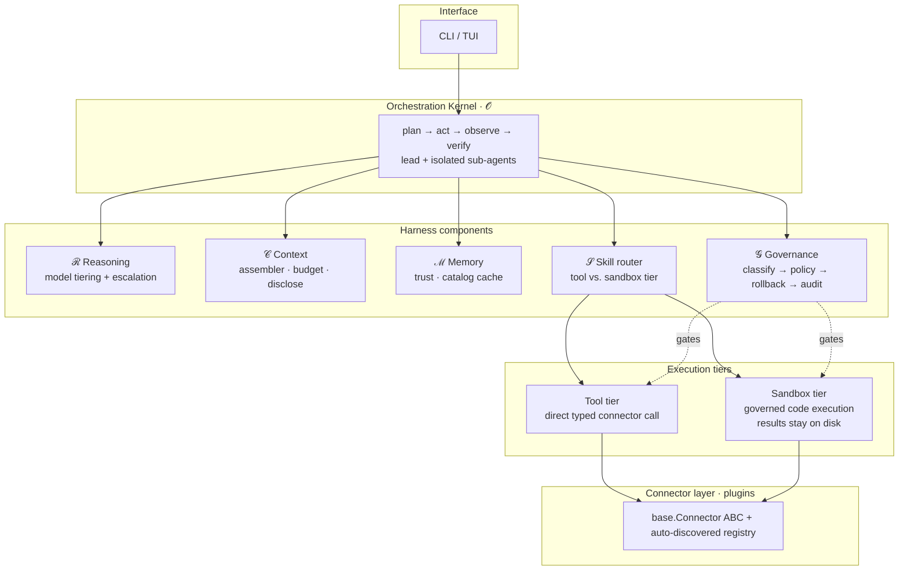
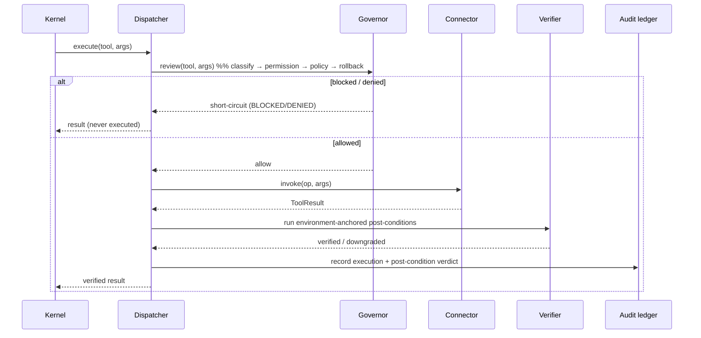

# Architecture

dacli is engineered as a **six-component harness**, following
*["From Model Scaling to System Scaling: Scaling the Harness in Agentic AI"](https://arxiv.org/abs/2605.26112)*.
The central premise is that agent reliability is a property of the *system around the model*, not the model
itself — so each component is designed, scaled, and tested as a first-class concern.

```
𝒫_H = Φ(ℛ, ℳ, 𝒞, 𝒮, 𝒪, 𝒢)
```

| Symbol | Component | Responsibility | Where it lives |
|---|---|---|---|
| **ℛ** | Reasoning substrate | The LLM, with cheap/strong model tiering and escalation. | `reasoning/` |
| **ℳ** | Memory store | Trust-aware facts: confidence, recency, provenance; catalog cache. | `memory/` |
| **𝒞** | Context constructor | Input assembly as a selection policy: priors + JIT + live search. | `context/` |
| **𝒮** | Skill-routing layer | Tool/sandbox dispatch over self-describing connector & skill plugins. | `connectors/`, `skills/` |
| **𝒪** | Orchestration loop | Plan → act → observe → verify; DAG planner; multi-agent. | `core/` |
| **𝒢** | Verification & governance | Gates every reasoning output and external action. | `governance/`, `core/verify.py` |

---

## The microkernel

dacli is deliberately **not** a framework and **not** a god-object. It is a small kernel that owns the control
loop and knows nothing platform-specific; everything platform-specific is a discovered plugin.



**Why a microkernel.** A connector is a self-contained plugin (`connector.py` + `manifest.yaml` + `SKILL.md`).
Adding a platform never touches the kernel — which is what makes platform expansion additive and safe rather
than a merge-conflict death march.

**Why no MCP.** Presenting tools as code the agent *composes* (and disclosing tool definitions just-in-time)
keeps context lean and execution auditable, versus loading every tool definition up front and routing every
intermediate byte through the model. The connector layer is plain Python/CLI; the sandbox tier lets the agent
compose connectors in code with results staying on disk.

---

## Component deep-dive

### ℛ Reasoning — `reasoning/`

- `llm.py` — a provider-agnostic client (OpenAI, Anthropic, Google, OpenRouter).
- `model_router.py` — routes each call to a **cheap** or **strong** tier by the *kind* of call and its *stakes*
  (classification/summarization → cheap; diagnosis/irreversible-plan/synthesis → strong), and **escalates
  weak→strong** on low confidence or a failed verification — never the reverse. Every choice is logged.

A single-model configuration routes everything to the same model, so tiering is opt-in and never changes
behavior unless configured.

### ℳ Memory — `memory/`

The antidote to the *stale-but-confident* failure mode. Every fact is a typed entry with `confidence`,
`last_verified`, `valid_until`, and `source`; persistence is an **append-only JSONL event log** (corrections
append + link via `supersedes`, never silently rewrite). Retrieval ranks by:

```
rank = relevance × (1 − staleness_penalty) × confidence
```

so an old fact sinks below a fresh, lower-relevance one instead of masquerading as current. **Trust is a
runtime decision** — retrieved content is a *hypothesis* until re-verified against the live system. A
**catalog cache** (`catalog.py`) gives introspected schema its own TTL + write-invalidation. Memory also holds
**episodic** traces and distilled **procedural** runbooks.

### 𝒞 Context — `context/`

Context is the output of a *selection policy*, not a fixed buffer. The assembler packs three layers —
persistent priors, just-in-time retrieval, and live-environment search — under a **token budget** with
per-source ceilings, tags every chunk with its **provenance**, **compacts** history under pressure, and
**progressively discloses** connectors/skills (the model sees a one-line digest until it selects a connector,
then full schemas are fetched). Large tool results are **spilled** to a session workspace and replaced with a
structured summary + fetch handle.

### 𝒮 Skills & routing — `connectors/`, `skills/`

- `connectors/base.py` — the `Connector` ABC, `OperationSpec` (name, JSON schema, `Risk`, post-conditions),
  and `ToolResult`.
- `connectors/registry.py` — discovers connectors from `manifest.yaml`, builds LLM tool definitions, resolves
  tool names to `(connector, op)`, and enforces *"no post-condition, no registration."*
- `connectors/dispatcher.py` — the **one governed dispatch path**: governance pre-flight → `invoke` →
  post-condition verify → audit + catalog effects. Both tiers and the sandbox go through it.
- `core/router.py` — the **TierRouter** classifies each task as *tool tier* (a single scoped op) vs.
  *sandbox tier* (multi-step/large-data/cross-platform), with confidence-aware escalation.
- `skills/` — contracted procedures (e.g. `diagram_mermaid`) surfaced as a built-in connector, with the same
  mandatory post-condition rule.

### 𝒪 Orchestration — `core/`

- `planner.py` — decomposes a goal into a **dependency DAG** of subtasks with explicit success criteria; a
  **complexity gate** keeps trivial goals on the single-step path.
- `loop.py` — the **plan → act → observe → verify** controller with a mandatory, environment-anchored verify
  step and **bounded, informed self-correction** (the retry is fed the real failure feedback and escalates the
  model tier; the budget is finite, then it escalates to a human).
- `blackboard.py` — append-only shared state with contradiction detection/resolution and task-claim
  de-duplication.
- `subagent.py` — a **lead** fans breadth-first work out to **isolated-context sub-agents** and merges their
  token-bounded summaries via the blackboard.
- `kernel.py` — the default single-step control loop; `agent.py` is a thin wiring object.

> **Gating (P08).** The orchestration stack is **opt-in**, built and reached only when
> `orchestration.enabled` (default **off**, so a plain startup is lean — no planner/blackboard/
> lead/orchestrator/model-router/tier-router constructed). When enabled, `process_message`
> applies a conservative complexity gate: an explicit `/plan` or a genuinely multi-step goal
> goes through `process_goal` → `TierRouter.route()` → planner DAG → plan→act→observe→verify;
> every other turn stays on the cheap kernel loop.

### 𝒢 Governance — `governance/`, `core/verify.py`

See [GOVERNANCE.md](GOVERNANCE.md). In short: a blast-radius **classifier** tiers each action, a **policy
engine** maps the tier to a decision (auto/verify/confirm/dry-run+approve), a **rollback strategist** attaches
and *verifies* a native undo plan, a **permission registry** enforces least-privilege scope, an optional
**shadow executor** runs risky transforms on a clone first, and an **append-only audit ledger** records every
decision. `core/verify.py` provides the post-condition framework that makes "verified success" the only kind.

---

## The two execution tiers

| | Tool tier | Sandbox tier |
|---|---|---|
| **When** | A single, well-scoped op on one platform. | Multi-step, large-data, or cross-platform work. |
| **How** | A direct typed connector call. | The agent writes code against the connector SDK; it runs in the governed sandbox. |
| **Results** | Returned to context. | Large results stay **on disk**; only a summary returns. |
| **Governance** | Through the dispatcher. | Through the **same** dispatcher — the sandbox is not a bypass. |

The router picks the tier per task; both are governed and verified identically.

---

## Data flow of one governed action



---

## Design principles

1. Build all six components together; never let one lag.
2. Memory is a hypothesis, not a fact — re-verify before acting.
3. Context is a selection policy, not a buffer — every token carries a source.
4. Fluent ≠ correct — every skill invocation has an environment-anchored post-condition.
5. The environment is the oracle — use transactions, dry-runs, clones, and tests for safety.
6. Scale skills and governance together — no capability ships without its rollback/audit/permission counterpart.
7. Keep results out of context — large data lives on disk; the model sees summaries.
8. Everything is auditable — memory writes, routing decisions, tool calls, and approvals are on the ledger.
