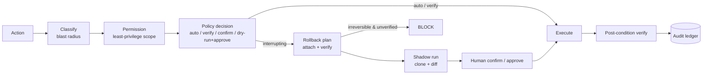

# Governance (𝒢)

Governance is dacli's reliability keystone. **Every state-changing action** — whether issued by the tool tier
or composed as code in the sandbox — passes through a single governed pipeline before it runs, and its outcome
is recorded in an append-only audit ledger.



The pipeline is **fail-closed**: if an interrupting decision has no approver wired (e.g. a non-interactive
run), the action is denied rather than silently executed.

---

## Blast-radius classification — `governance/classifier.py`

Every action is mapped to a **tier** before it runs. The tier — not the model's confidence — is what the
policy engine gates on.

| Tier | Examples | Default policy |
|---|---|---|
| `safe` | `SELECT`, list, describe, `EXPLAIN`, dry-run | auto-run |
| `write` | `CREATE`, `INSERT`, `COPY INTO`, push file | auto-run + post-condition |
| `risky` | `UPDATE`, `DELETE`, `MERGE`, overwrite, trigger | confirm + rollback plan |
| `irreversible` | `DROP`, `TRUNCATE`, prod writes, force-push | dry-run + **verified** rollback + explicit approval |

The tier is derived from three **grounded** signals — never the model's say-so:

1. **The op's declared `Risk` hint** — the floor for any op we cannot inspect more closely.
2. **A whole-statement SQL parse** — a `SELECT` carried by a `RISKY`-declared op is really safe; a `DROP`
   hidden in a CTE is really irreversible. Unparseable/multi-statement SQL **defaults to `risky`** (default-deny).
3. **Production detection** — a prod target (`PROD`/`GOLD`/…) **promotes** the tier one step, because the most
   catastrophic agent actions are the *right* operation against the *wrong* environment.

---

## Policy engine — `governance/policy_engine.py`

Maps `(tier, connector, environment)` to one of four decisions: `auto`, `verify`, `confirm`,
`dry_run+approve`. The table is overridable from `config/policy.yaml` so a team can tune velocity vs. caution
**without code changes** (e.g. mark a `dev` warehouse `auto` for writes, or a prod profile `confirm` even for
writes). Most-specific override wins: `connector.environments.<env>` ▸ `connector.tiers` ▸ global `defaults` ▸
the locked posture.

---

## Rollback — `governance/rollback.py`

For every gated action dacli attaches a rollback plan built from the platform's **native** undo primitive
(see the table in [CONNECTORS.md](CONNECTORS.md)). The decisive rule:

> An **irreversible** action is **blocked** unless its rollback path is **verified to exist** — retention
> actually enabled, versioning actually on, a snapshot actually creatable — *not merely assumed*.

Verification is delegated to the connector's `verify_rollback(plan, args)` hook, which interrogates the live
platform. A connector that cannot confirm a path yields `verified=False`, and the action is refused before any
human is even asked.

---

## Shadow execution — `governance/shadow.py`

Where a platform supports it, risky transforms run first on a **zero-copy clone** (Snowflake `CLONE`,
Databricks shallow clone, BigQuery snapshot); dacli diffs the result and only promotes on approval. The
original is untouched until then.

## Permissions

Least-privilege by default. Each connector is granted a **scope** that bounds the highest tier it may reach:

| Scope | Permits up to tier |
|---|---|
| `read_only` | `safe` |
| `write` | `write` |
| `risky` | `risky` |
| `admin` | `irreversible` |

Grants come from the connection profile (`config/policy.yaml`); anything unspecified stays at the read-only
floor. The sandbox SDK consults the **same** registry, so code-execution cannot escape its connector's scope.

---

## The audit ledger — `governance/audit.py`

The tool log records *what ran*; the ledger records *why* — the chain of decisions that let (or stopped) an
action: the classifier's tier, the policy decision and which override produced it, the permission check, the
rollback plan and whether it was verified, the human approval/denial, the post-condition verdict, and memory
writes. It is **append-only** JSON Lines, so a session is fully reconstructable across runs.

```bash
dacli audit                  # decisions for the current/last session
dacli audit --session <id>   # a specific session
dacli audit --full           # every event in each decision
```

---

## Post-conditions — `core/verify.py`

Governance gates an action *before* it runs; post-conditions gate the *result*. Every connector operation and
skill declares mandatory post-conditions, and the dispatcher runs them after execution — **a failed check
downgrades the result to an error** so the kernel and the catalog never treat an unverified outcome as done.
The registry enforces *"no post-condition, no registration."* Reusable, environment-anchored factories ask the
platform (row counts, information-schema, content hashes, commit SHAs), not the model.

---

## The sandbox — `sandbox/`

Complex/multi-step/cross-platform jobs run as **governed code** in a sandbox runtime. Its SDK calls back
through the *same* governed `dispatcher.execute`, so code-execution is not a governance bypass. Large results
stay **on disk**; only a summary returns to context. The sandbox is capability-gated with no ambient
credentials, a configurable egress policy (`off` / `allowlist` / `open`), resource limits, and full audit.

**The subprocess shell jail is advisory.** With the `subprocess` runtime, the terminal session tracks its
working directory by parsing a leading `cd` (`sandbox/terminal.py`, `_maybe_update_cwd`) — `pushd`,
subshells, or `cd "$(…)"` are not reflected. The command classifier still gates obvious escapes, but cwd
tracking is a heuristic, not a boundary. Real isolation comes from the **docker** sandbox runtime
(`sandbox.runtime: docker`); prefer it for untrusted shell work.

### Encryption threat model

Secrets are encrypted at rest with Fernet; the key lives in `.dacli/.key` (gitignored), next to the
ciphertext in `.dacli/dacli.json`. This protects against **accidental git commits and casual inspection /
screen-shares** — it does **not** protect against a local attacker with filesystem access, who can read the
key and the ciphertext alike (`chmod 600` on the key file is best-effort and a no-op on Windows). To keep
the key off-disk, set `DACLI_ENCRYPTION_KEY` (env var or secret manager); it takes priority over `.dacli/.key`
and accepts either a raw Fernet key or a password (derived via PBKDF2) — see `core/crypto.py`.

---

## Failure modes this defends against

| Failure mode | Defense |
|---|---|
| **Stale-but-confident** — acting on an outdated cached fact. | Staleness-penalized retrieval + mandatory live re-verification before any risky/irreversible action. |
| **Confident-but-unchecked** — fluent output that is silently wrong. | Mandatory environment-anchored post-conditions; a failed check fails the result. |
| **Right op, wrong environment** — destructive action against prod. | Production detection promotes the tier; prod policies can require approval even for writes. |
| **Irreversible-with-no-undo** — a `DROP` with no recovery path. | Blocked unless a native rollback path is *verified* live. |
| **Governance debt** — capabilities added faster than their guards. | The connector Definition of Done is CI-enforced (see [CONNECTORS.md](CONNECTORS.md)). |
